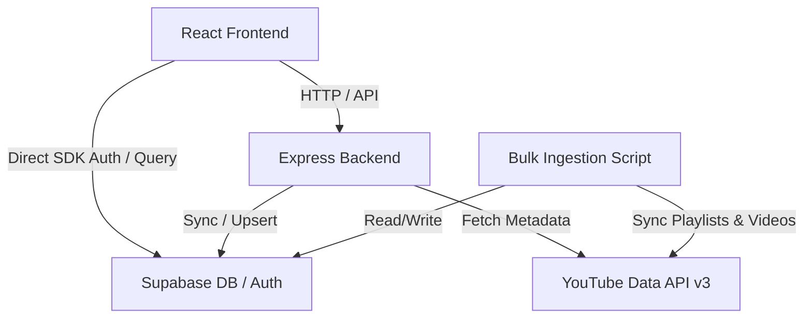
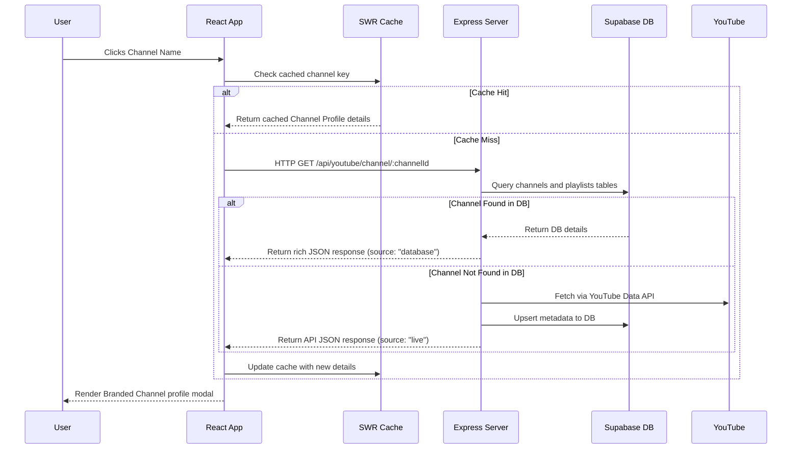

# 🧠 BioVised System Architecture & Knowledge Base (brain.md)

This document serves as the project's single source of truth, describing the codebase architecture, database schemas, APIs, caching policies, execution workflows, and coding standards.

---

## 1. Project Purpose
**BioVised** is a premium educational video curation and exam preparation platform designed for students preparing for competitive exams in India (JEE, NEET). It aggregates, curates, and categorizes academic lectures and playlists from YouTube, filtering out non-academic content (promotional updates, clickbaits, strategy sessions) and kid/entertainment content (cartoons, nursery rhymes) to provide a clean, distraction-free environment.

---

## 2. High-Level Architecture
The platform is built as a monolithic full-stack application using a decoupling model:
* **Frontend**: Single Page Application (SPA) built with React, Vite, and TailwindCSS. Data-fetching uses SWR (Stale-While-Revalidate) for performance caching.
* **Backend**: Node.js + Express API server acting as an orchestration layer between the database, client request routing, and YouTube Data API.
* **Database**: PostgreSQL hosted on Supabase, serving as the system's ground truth for curriculum structure, videos, teachers, batches, and reviews.



---

## 3. Folder Responsibilities
* [/](file:///c:/Users/abhii/Downloads/websitezerozon/osmosis.in/Oooooooo-main/): Contains root project configuration files, deploy definitions, and server entry point (`server.ts`).
* [scripts/](file:///c:/Users/abhii/Downloads/websitezerozon/osmosis.in/Oooooooo-main/scripts/): Standalone database validation, ingestion pipeline, cleanup, and channel seeding utilities.
* [src/](file:///c:/Users/abhii/Downloads/websitezerozon/osmosis.in/Oooooooo-main/src/): React application codebase:
  * [src/components/](file:///c:/Users/abhii/Downloads/websitezerozon/osmosis.in/Oooooooo-main/src/components/): Modular UI components (LectureCard, SearchView, MicModal, skeletons, admin dashboard tabs).
  * [src/config/](file:///c:/Users/abhii/Downloads/websitezerozon/osmosis.in/Oooooooo-main/src/config/): Static configurations, teacher catalogs, and registered channel lists.
  * [src/context/](file:///c:/Users/abhii/Downloads/websitezerozon/osmosis.in/Oooooooo-main/src/context/): React contexts for authentication (`AuthContext.tsx`), playback states, search queries, and themes.
  * [src/routes/](file:///c:/Users/abhii/Downloads/websitezerozon/osmosis.in/Oooooooo-main/src/routes/): Express route controllers (`youtube.ts`, `lectureRoutes.ts`).
  * [src/services/](file:///c:/Users/abhii/Downloads/websitezerozon/osmosis.in/Oooooooo-main/src/services/): Client and server utility services (dbService, youtubeService, cdnVerifyScript).
  * [src/utils/](file:///c:/Users/abhii/Downloads/websitezerozon/osmosis.in/Oooooooo-main/src/utils/): Helper functions (SWR caching client, duration parsers, denylist filters).
* [supabase/](file:///c:/Users/abhii/Downloads/websitezerozon/osmosis.in/Oooooooo-main/supabase/): Database migration SQL definitions (`001_youtube_cache_schema.sql`, `002_add_playlist_routing_columns.sql`, `003_required_data_schema.sql`).

---

## 4. Technology Stack
* **Build System**: Vite (Frontend), tsx/esbuild (Backend runtime)
* **Frontend Core**: React 18, TypeScript, TailwindCSS, Lucide Icons, Framer Motion (`motion/react`)
* **Backend Core**: Express.js (Node.js ESM mode), Axios
* **Database**: PostgreSQL (Supabase client/REST)
* **Authentication**: Supabase GoTrue Auth
* **State Management**: React Context, SWR Caching Layer

---

## 5. Dependency Graph
```
Vite Dev Server (Frontend Compiler)
  └─ App.tsx (Main Root)
       ├─ Contexts (AuthContext, SearchContext, PlayerContext, ThemeContext)
       ├─ SWR (swrConfig.ts - Caching Layer)
       └─ Views (HomeDashboard, VideoLibrary, SearchView, ChannelProfile, DetailsModal)
            └─ Components (LectureCard, MicModal, SafeImage)
Node.js Runtime (Backend Compiler)
  └─ server.ts (Express Entry)
       ├─ youtubeRouter (src/routes/youtube.ts)
       ├─ lectureRouter (src/routes/lectureRoutes.ts)
       └─ InMemorySearchIndex (Search Cache / Match Engine)
```

---

## 6. Execution Flow


---

## 7. Request Lifecycle
1. **Frontend Initiation**: Client requests data using custom hooks wrapped with `useSWR(key, fetcher, options)`.
2. **Central Cache Verification**: SWR matches the cache key. If a valid cached value exists (TTL 5 mins), it returns instantly.
3. **Backend Middleware**: If not cached, the client dispatches an HTTP request. The backend applies ESM-loaded environment configurations and route filters.
4. **Local DB Ground Truth Check**: Backend route handler checks Supabase first to retrieve matching records.
5. **Upstream Ingestion Fallback**: If missing from the DB, the backend falls back to fetching from the YouTube Data API using the `YOUTUBE_API_KEY`, caching and syncing the result to the DB before returning.

---

## 8. Database Design
The system uses a Postgres schema with relational constraints:

```sql
-- Teachers profile details
CREATE TABLE public.teachers (
    id VARCHAR(255) PRIMARY KEY,
    name VARCHAR(255) NOT NULL,
    subject VARCHAR(255) NOT NULL,
    avatar VARCHAR(1024),
    rating NUMERIC(3, 2),
    bio TEXT,
    is_verified BOOLEAN,
    subjects JSONB,
    exams JSONB,
    features JSONB,
    created_at TIMESTAMPTZ,
    updated_at TIMESTAMPTZ
);

-- Course Series Playlists (curriculum category groupings)
CREATE TABLE public.playlists (
    id VARCHAR(255) PRIMARY KEY,
    title VARCHAR(255) NOT NULL,
    category VARCHAR(255) NOT NULL,
    thumbnail VARCHAR(1024),
    description TEXT,
    teacher_id VARCHAR(255) REFERENCES public.teachers(id),
    lectures_count INTEGER,
    exam_type VARCHAR(100),
    is_active BOOLEAN,
    cover_thumbnail_url TEXT,
    channel_title TEXT,
    channel_id TEXT,
    channel_thumbnail_url TEXT,
    content_type TEXT,
    total_duration_seconds INTEGER,
    subject_tags JSONB,
    exam_tags JSONB,
    last_synced_at TIMESTAMPTZ,
    created_at TIMESTAMPTZ,
    updated_at TIMESTAMPTZ
);

-- Individual Video Lectures (inside playlists)
CREATE TABLE public.videos (
    id VARCHAR(255) PRIMARY KEY,
    title VARCHAR(255) NOT NULL,
    video_url VARCHAR(1024) NOT NULL,
    duration VARCHAR(50),
    category VARCHAR(255),
    playlist_id VARCHAR(255) REFERENCES public.playlists(id) ON DELETE CASCADE,
    views INTEGER,
    thumbnail_url VARCHAR(1024),
    subject VARCHAR(255),
    exam_type VARCHAR(100),
    content_type VARCHAR(50),
    teacher_id VARCHAR(255),
    teacher_name VARCHAR(255),
    institute_id VARCHAR(255),
    institute_name VARCHAR(255),
    likes_count INTEGER,
    publish_date TIMESTAMPTZ,
    is_active BOOLEAN,
    position_in_playlist INTEGER,
    duration_seconds INTEGER,
    view_count INTEGER,
    like_count INTEGER,
    is_playable BOOLEAN,
    embed_url TEXT,
    created_at TIMESTAMPTZ,
    updated_at TIMESTAMPTZ
);
```

---

## 9. API Contracts

### Auto-Suggest Autocomplete API
`GET /api/search/suggestions?q=:query&examType=:examType`
* **Response Contract (JSON)**:
```json
{
  "status": "ok",
  "suggestions": [
    {
      "id": "UCWFXoexcMI1jQrHH2N-SJzQ",
      "type": "teacher",
      "title": "Sankalp NEET Vedantu",
      "thumbnailUrl": "https://yt3.ggpht.com/...",
      "subtitle": "Educator • Biology"
    }
  ]
}
```

### Channel Profile Sync API
`GET /api/youtube/channel/:channelId`
* **Response Contract (JSON)**:
```json
{
  "status": "ok",
  "source": "database",
  "data": {
    "id": "UCWFXoexcMI1jQrHH2N-SJzQ",
    "title": "Sankalp NEET Vedantu",
    "customName": "@VedantuSankalpNEET",
    "logo": "https://...",
    "banner": "https://...",
    "subscriberCount": 425000,
    "viewCount": 24000000,
    "videoCount": 4261,
    "playlists": []
  }
}
```

---

## 10. Key Algorithms & Business Logic

### Academic Curation Filter
Ensures that all video entries comply with educational standards:
1. **Duration Filter**: Active videos must be **$\ge 20\text{ minutes}$** ($1200\text{ seconds}$).
2. **Denylist Filter**: Matches titles against keyword criteria to reject news, clickbaits, cartoons, and child-related content.
```typescript
const junkKeywords = [
  'cocomelon', 'cartoon', 'rhyme', 'nursery', 'peppa pig', 'chuchu tv',
  'kids song', 'baby', 'sleep music', 'lullaby', 'toy', 'animation for kids',
  'strategy', 'mistake', 'good news', 'roadmap', 'cutoff', 'news'
];
```

### Autocomplete Match Scoring
The server matches search tokens and ranks them by:
$$\text{Score} = \text{Base Match Weight} \times \text{Prefix Similarity} \times \left(\frac{1}{\text{Token Index} + 1}\right) + \text{Verification Bonus} + \text{Trust Bonus}$$

---

## 11. Configuration
* [src/config/youtubeChannels.json](file:///c:/Users/abhii/Downloads/websitezerozon/osmosis.in/Oooooooo-main/src/config/youtubeChannels.json): Verified registered list mapping channel titles to YouTube channel IDs.
* [src/config/constants.ts](file:///c:/Users/abhii/Downloads/websitezerozon/osmosis.in/Oooooooo-main/src/config/constants.ts): Holds subject categories, view name constants, and global route parameters.

---

## 12. Environment Variables
* `PORT`: Server execution port (default: 3000/3001)
* `SUPABASE_URL`: Supabase project database connection endpoint
* `SUPABASE_SERVICE_ROLE_KEY`: Service role API key for bypassing RLS during bulk administration operations
* `YOUTUBE_API_KEY`: Google Cloud Console YouTube Data API v3 integration key

---

## 13. Coding Standards
1. **TypeScript Verification**: All source code files must build cleanly with `tsc --noEmit` and avoid using `any` unless absolutely necessary.
2. **ESM Load Order**: Environment variables (`dotenv.config()`) must load immediately at module execution before other components resolve.
3. **No Placeholders**: Never include empty placeholders or dummy alert statements in runtime files.

---

## 14. Naming Conventions
* **SQL Columns**: Snake-case format matching PostgreSQL specifications (`cover_thumbnail_url`, `lectures_count`).
* **TypeScript Variable/Method Names**: Camel-case conventions (`totalDurationSeconds`, `getRichSuggestions`).
* **React Components**: Pascal-case format (`HomeDashboard.tsx`, `MicModal.tsx`).

---

## 15. Reusable Patterns
* **SWR Mutators**: Front-end state cache keys must be invalidated upon mutate commands:
  ```typescript
  import { mutate } from 'swr';
  mutate(SWR_KEYS.PLAYLISTS);
  ```
* **Card Skeletons**: Smooth pulsing placeholder layouts for dashboards loaded during SWR network requests.

---

## 16. Error Handling
* **React Boundary**: Uses `<ErrorBoundary>` wrapper to isolate execution crashes.
* **API Safety**: Express routes wrap async requests in standard try/catch blocks returning descriptive JSON status flags:
  ```typescript
  return res.status(500).json({ error: err.message || 'Error occurred.' });
  ```

---

## 17. Security Practices
* **Service Key Protection**: `SUPABASE_SERVICE_ROLE_KEY` must remain strictly server-side and never leak to the front-end client bundle.
* **RLS Policies**: supabase public tables must be protected by Row Level Security (RLS) policies.

---

## 18. Performance Considerations
* **SWR Deduplication**: Prevent request flooding on view switching by setting deduplication intervals:
  `dedupingInterval: 5 * 60 * 1000` (5 minutes TTL).
* **Supabase Payload Chunking**: Ingestion runs chunk payload uploads in batches of 50 to prevent packet size limitations.

---

## 19. External Integrations
* **YouTube Data API v3**: Fetches channels, playlists, and video hydration details.
* **Web Speech Recognition API**: Drives real-time speech translation in `MicModal.tsx`.
* **Web Audio API**: Drives audio visualizations by processing voice frequencies with an `AnalyserNode`.

---

## 20. Testing Strategy
* **Verification Queries**: Run database validation routines using scripts like [clean_and_validate.ts](file:///c:/Users/abhii/Downloads/websitezerozon/osmosis.in/Oooooooo-main/scripts/clean_and_validate.ts).
* **Build Check**: Verification of type safety via continuous TypeScript builds (`tsc --noEmit`).

---

## 21. CI/CD Pipeline
* **Vercel Deployments**: Deployment definition defined in `vercel.json` for frontend builds.
* **Production Rule**: Automated git push or production deploys must not run unless explicitly requested by developers.

---

## 22. Deployment
* **Client Frontend**: Bundled and compiled statically by Vite, deployable to Vercel/CDN.
* **Backend Server**: Executed in Node.js on port 3001 using package scripts.

---

## 23. Common Commands
* Run developer server locally: `npm run dev`
* Run backend Express server: `npx tsx server.ts`
* Execute compiler check: `npx tsc --noEmit`
* Validate active catalog statistics: `npx tsx scripts/clean_and_validate.ts`
* Ingest 5 target channels: `npx tsx scripts/ingest_five_channels.ts`

---

## 24. Important Files
* [server.ts](file:///c:/Users/abhii/Downloads/websitezerozon/osmosis.in/Oooooooo-main/server.ts): Express server entry point.
* [src/App.tsx](file:///c:/Users/abhii/Downloads/websitezerozon/osmosis.in/Oooooooo-main/src/App.tsx): Frontend routing and views orchestrator.
* [src/routes/youtube.ts](file:///c:/Users/abhii/Downloads/websitezerozon/osmosis.in/Oooooooo-main/src/routes/youtube.ts): YouTube proxy controller and DB caching.
* [scripts/ingest_five_channels.ts](file:///c:/Users/abhii/Downloads/websitezerozon/osmosis.in/Oooooooo-main/scripts/ingest_five_channels.ts): Bulk channel ingestion pipeline.

---

## 25. Known Limitations
* **YouTube Quota Limits**: Upstream calls consume YouTube API quota. Mitigated by caching and serving from local database records first.

---

## 26. Assumptions & Unknowns
* **Live Streams**: The live streaming detection endpoint `/channel/:channelId` assumes the presence of live broadcasts and returns null if none exist without crashing.

---

## 27. Data Flow Overview
```
[User Query] 
   └─ SearchView.tsx (debounces query, dispatches GET /api/search/suggestions)
        └─ server.ts (searches local InMemorySearchIndex)
             └─ suggestions return to SearchView.tsx 
                  └─ Clicks rich mini card 
                       └─ Navigates directly to VideoPlayer/ChannelProfile (instant load)
```

---

## 28. Maintenance Guidelines
* Keep SWR cache keys synchronized across mutation boundaries.
* Regularly execute validation checks (`scripts/clean_and_validate.ts`) after any bulk data syncs.
