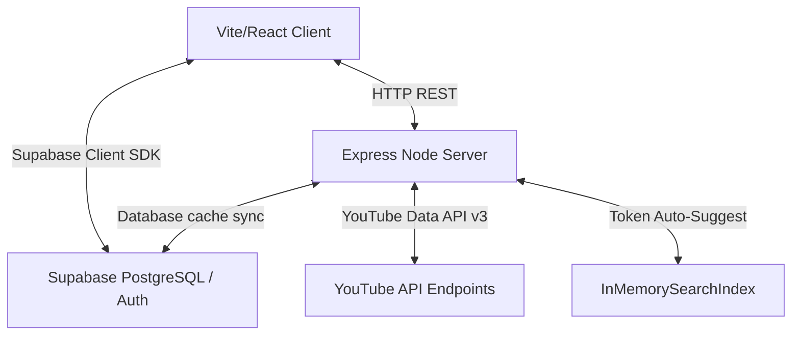

# System Overview

An architectural blueprint of the BioVised system mapping the frontend layout, backend controllers, and database services.

```mermaid
graph TD
    A[Vite/React Client] <-->|Supabase Client SDK| B[Supabase PostgreSQL / Auth]
    A <-->|HTTP REST| C[Express Node Server]
    C <-->|YouTube Data API v3| D[YouTube API Endpoints]
    C <-->|Database cache sync| B
    C <-->|Token Auto-Suggest| E[InMemorySearchIndex]
```
