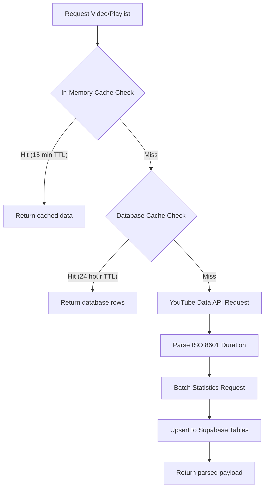

# youtubeService 📡

The backend ingestion pipeline and caching layer for fetching channels and courses from the YouTube Data API v3.

- **Path**: `src/services/youtubeService.ts`
- **Related Notes**: [[dbService]], [[Supabase Schema]], [[VideoLibrary]]

---

## ⚙️ Multi-Stage Pipeline Flow

---

## 💡 Engineering Highlights

- **ISO Duration Parser**: Converts YouTube API's complex durations (like `PT14M3S`) to clean frontend display formats (`14:03`).
- **Batch Statistics Engine**: Groups video IDs in sets of 50 to make single-request stats queries for `viewCount` and `likeCount`.
- **Database Sync**: Channel metadata (subscriber counts, avatars) are upserted into `channels` to keep local profiles fresh.
- **Fail-Safe Fallbacks**: If API quotas are exceeded, the pipeline catches errors gracefully and serves the latest database cache to prevent frontend disruption.
